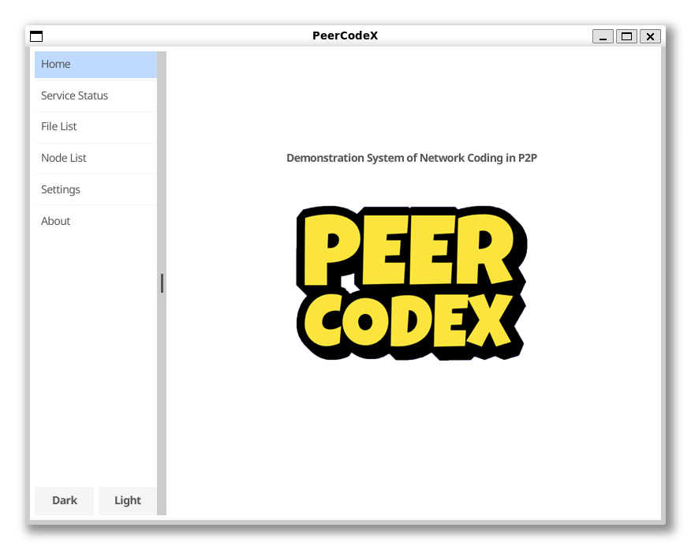
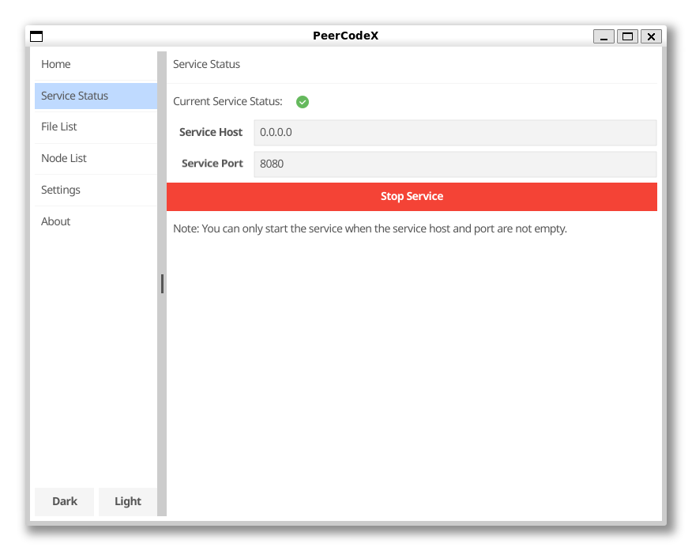
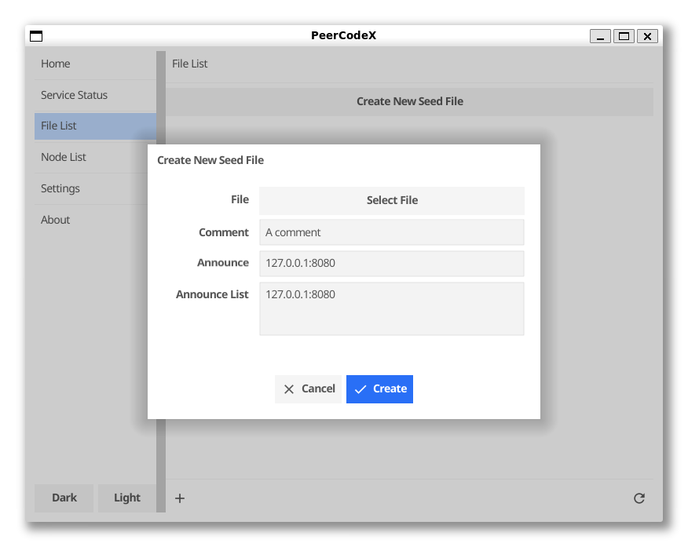
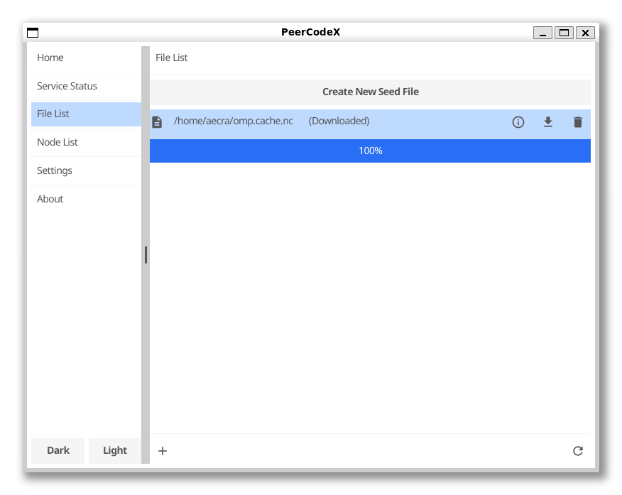

# PeerCodeX - A Peer-to-Peer Code Sharing Platform

A distributed file sharing system.

## Introduction

PeerCodeX is a distributed file sharing system based on random linear network coding. It uses a generational encoding scheme that greatly reduces the impact of file size on system performance. At the same time, sparse coding is adopted to reduce the complexity of coding and decoding. After testing, PeerCodeX finally adopted a coding scheme of 128MB generation, 1MB fragmentation, and 0.95 sparsity.

The decoding uses the Gaussian Jordan elimination algorithm. In order to improve the decoding efficiency, PeerCodeX uses a parallel decoding scheme in the elimination and back-substitution process.

## Screenshots









## Requirements

- Go 1.20+

## Usage

```bash
go build . && ./PeerCodeX
```

## CopyRight

The RLNC code is derived from [itzmeanjan/kodr](https://github.com/itzmeanjan/kodr). The GaloisField is copied from [cloud9-tools/go-galoisfield](https://github.com/cloud9-tools/go-galoisfield). Thanks for their great work.
